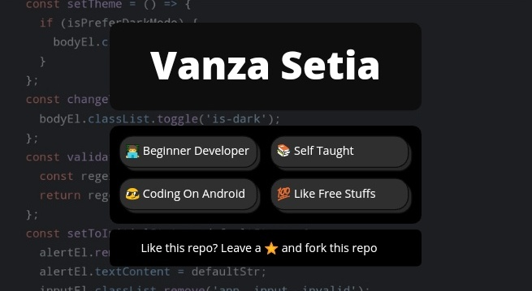
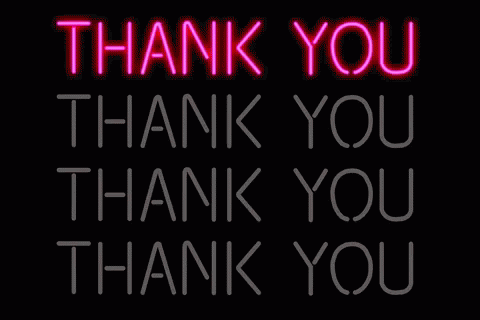

# 👋 Hello Everyone!

   
   
  
  

## Who are you?
My name is Vanza Setia. I'm a beginner web developer that like doing coding challenges and helping people on Frontend Mentor by giving them valuable feedback.

I love building things with code, especially a website. When, I was a kid I really wish that I could make something live on the internet. Now, here I'm 😁.

## A Little Facts On How I Code
I code on my Android phone. It's surprising that I can learn coding on my phone. Someday, I will code on laptop.

   &nbsp;
  

## Skills
Currently, I have HTML, CSS, Sass, and the fundamentals of Vanilla JavaScript under my belt. I also understand about basic linux and git command.

  
   &nbsp;
  

## What are you currently learning?
Right now, I'm learning Vanilla JavaScript, Git, Search Engine Optimization, Web Accessibility, and much more.

   &nbsp;
  
  
  

## How can I connect with you?
You can email me through <a href="mailto: venusbumi2@gmail.com">Gmail</a> or you can chat with me on [Twitter](https://twitter.com/vanzasetia). You can talk to me about coding in general or ask me anything.

I also has joined the [Frontend Mentor Slack Community](https://frontendmentor.slack.com), you can chat with me there too.

   &nbsp;
   &nbsp;
  

## Blog posts
<!-- BLOG-POST-LIST:START -->
- [Random Quote Generator](https://community.codenewbie.org/vanzasetia/random-quote-generator-a8o)
- [Relative vs Absolute File Paths](https://community.codenewbie.org/vanzasetia/relative-vs-absolute-file-paths-4j1n)
<!-- BLOG-POST-LIST:END -->

## GitHub Stats

## Trophy

  

## Thanks For Visiting

